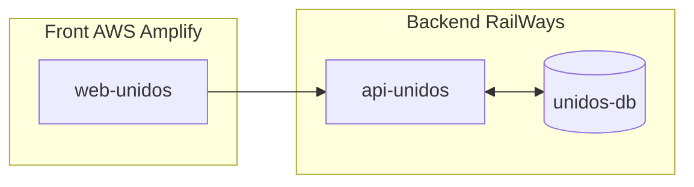

```mermaid

flowchart LR
    subgraph aws[Front AWS Amplify]
    direction LR
    web_unidos[web-unidos]

    end

    subgraph backend[Backend RailWays]
    direction LR
    api[api-unidos]
    database[(unidos-db)]

    api <--> database
    web_unidos --> api
    end

```

